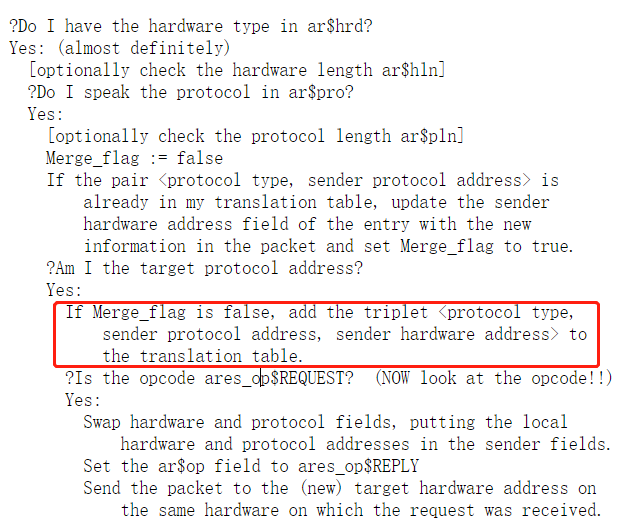

# 路由器实验报告

软件02班  潘首安  2019010575

## 一、实验环境

- Ubuntu 16.04.7
- Python 2.7.12
- gcc 5.4.0

## 二、项目架构

### 1. 包处理

本实验中处理包的方法是自顶向下分段处理。`handlePacket` 函数接收数据包，检验以太帧合法性(包大小及目的地址)。如果数据包符合要求，则根据类型分发到 `handleARP` 和 `handleIPv4`函数继续处理，否则丢弃。

`handleARP` 函数首先检查 ARP 包的合法性(大小，硬件地址及长度，协议类型及长度)，然后判断 ARP 包的类型是请求还是回复再进一步分发处理。对于 ARP Request，检查 IP 地址如果为本路由器，则生成 ARP Reply 报文并回复；对于 ARP Reply，如果该 IP/MAC 对无法在 ARP 缓存中查询到，将之插入到 ARP 缓存中并处理相关的请求，最后将请求从 `m_arp` 的请求队列中删除即可。

`handleIPv4` 函数首先检查 IPv4 包的合法性(大小，校验和)，然后根据目的 IP 进行分发。如果目的 IP 不属于本路由器，则检查 TTL 并进行转发或回复 `icmp` 超时报文；如果目的 IP 属于本路由器，则根据 IP 数据包的类型进行处理：处理对于 tcp 或 udp 类型的报文，返回 `icmp` 端口不可达报文，对于 `Echo Icmp` 的报文，转交 `handleICMP` 进行。

`handleICMP` 函数先检查 ICMP 包的合法性(大小，校验和，类型)，然后返回生成 `Echo reply`  数据包并返回。

### 2. 路由表

对于路由表的匹配使用最长前缀匹配算法。对于给定的 IP，遍历路由表 `m_entries`，对于每一个表项 `entry`，将目的 IP 和 `entry.dest` 都和掩码 `mask` 进行“与”运算，然后进行比较。如果相同，则匹配成功。然后只要记录当前的掩码 `mask` 并与此前匹配成功的掩码 `matched_mask` 进行比较，如果当前的 `mask` 更大，则更新匹配项为当前项。最后返回 `matched_entry` 即可。

### 3. ARP 缓存

在 `arp-cache.cpp` 中，实现了一个周期性被调用的函数 `periodicCheckArpRequestsAndCacheEntries()`。主要功能是周期性检查 ARP 请求队列和 ARP 表。

对于 ARP 请求队列中发送次数小于 5 的 ARP 请求，将其再次发送；对于发送次数为 5 的 ARP 请求，向源地址发送主机不可达的 `ICMP` 报文，并且在队列中删除该请求。

对于 ARP 缓存中的表象，检查其如果失效，则进行删除。

## 三、实验中的问题

### 1. 回复类报文的发送问题

**问题描述:** 在收到指向本路由器 `ArpRequest`, `Echo` 的信息，需要向源 IP 发送回复类报文如 `ArpReply`, `TimeExceededIcmp` 等时，应该从 ARP 缓存内先查询 IP/MAC 对，并且从路由表中查询目的 IP 对应的发送端口，还是可以直接通过接收该数据包的端口发往源数据包中的 MAC 地址？

**解决方案:** 更为规范的做法是通过 IP 在路由表和 ARP 缓存中查询发送端口和下一跳的 MAC 地址。但是一个很合理的逻辑是，在本实验这个简单的网络拓扑中，数据包来回的成本是接近的，路由表也是固定的。因此回复数据包经过的路径一定是请求数据包的反向。因此不需要在路由表和 ARP 缓存中查询，可以直接通过源数据包确定发送端口和 ARP 地址。

### 2. ARP 缓存的死锁问题

**问题描述: ** 在 `arp-cache.cpp` 中，需要周期性地调用 `periodicCheckArpRequestsAndCacheEntries()` 函数检查 ARP 缓存中的 `ArpRequest`，对于已经被发送了五次而没被处理的请求，需要删除。但是调用项目给出的 `removeRequest()` 函数时会发生死锁。

**解决方案: ** 死锁的原因是 `removeRequest()` 会获取 ARP 缓存的锁，而在我实现的 `periodicCheckArpRequestsAndCacheEntries()` 函数中这个锁已经被持有，因此无法实现。因此，只需要记录需要删除的项，然后调用 `m_arpRequests.erase()` 函数处理即可。

### 3. 信息大小端存储的问题

**问题描述:** 在网络数据包中，各个变量是大端存储的方式，而在主机中是以小端存储的，因此在填入数据包时需要调用 `htons()` 进行转换。但是根据路由表搜寻到发送端口 `outIface` 调用 `htons()` 后出现转发失败的问题。

**解决方案: ** 在 `Interface` 类型中的 `ip` 和 `addr` 成员变量，也是按照网络数据包的方式存储的。因此不需要进行转换，直接赋值到目的 IP 和 MAC 地址上即可。

### 4. TTL为0时的处理/丢弃问题

**问题描述: ** 如果每个主机/路由器都发送 TTL 大于 0 的数据包，则路由器不会收到 TTL 为 0 的数据包。那么是否需要考虑 TTL 为 0 时的处理/丢弃问题呢？

**解决方案:** 事实上，允许主机发 TTL 为 0 的数据包。查阅 RFC 1812，如果该包不是发给本路由器的，接收到 TTL 为 0 或 1的情况都需要发超时 ICMP 报并忽略；如果该包是发给本路由器的，即使 TTL 为 0 也还是需要进行处理。

## 四、引用的外部库

- \<iostream\>
- \<algorithm\>

## 五、一些建议

### 1. ARP 缓存更新优化

建议可以设定在接收到 ARP request，且请求的 IP 地址为本路由器时，也将 ARP header 中发送方的 IP/MAC 键值对更新到 ARP 缓存中，这样比较符合 RFC 826 以及现实使用的情况。下图为 RFC 826 的描述：

### 2. 信息大小端存储的说明

建议在说明文档中，说明 `Interface` 类中对 `ip`, `addr` 的存储已经是按照网络数据包的大端存储实现。这样可以使学生在实现的过程中更方便一些，减少歧义。

### 3. 完善测试接口

目前的测试只能在完成所有功能后进行，无法进行阶段性的单元测试。而且无法自定义数据包的内容，只能通过 `ping`，`traceroute` 和 `wget` 命令控制数据包发送。建议添加一些测试接口，允许学生可以从任一端口发送自定义的数据包，便于测试。

### 4. Python 与 Ubuntu 版本更新

目前的 Python 代码为 2.7，且只能在 Ubuntu 16.04 上运行，与现有的比较方便的 WSL2 和 大多数 linux 服务器 (Ubuntu 20.04 版本)不兼容。使用 Ubuntu 16.04 的虚拟机比较卡，且不方便。建议有条件的话可以适当同步一下项目版本。

## 六、 实验感想

通过本次实验，我深入理解了路由器的原理，并熟练掌握了以太帧，IPv4，ARP，ICMP协议的组成和实现。同时，我也加深了对计算机网络分层结构的认识。感谢老师和助教在这个过程中的帮助与指导！
